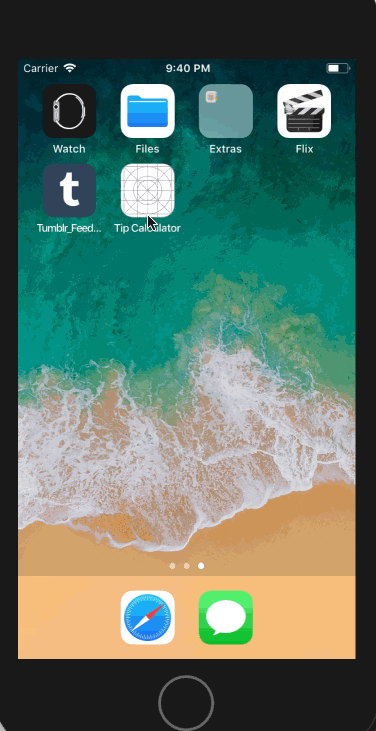

# Tip Calculator 
*****************************************************************************************************************************
App Description: This application is designed to calculate tip result of 15%, 20% and 25% based on input value.
Platform: IOS (Switft)
Date Created: Sept 14 2018
*****************************************************************************************************************************
Plan For Future for this Repo: Currently there is none for this application. However, if there is time, new features with notes on what is implemented will be described in this section. 

License: MIT
*****************************************************************************************************************************
## Video Walkthrough

Here's a walkthrough of implemented user stories:

GIF created with [LiceCap](http://www.cockos.com/licecap/).
